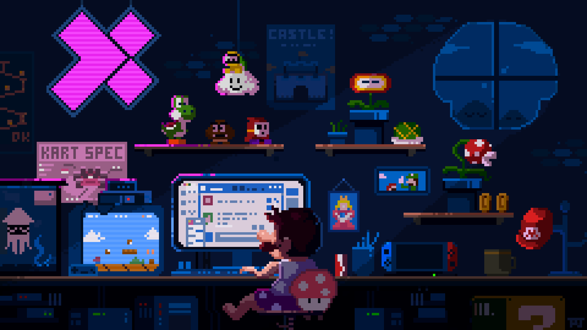

   <h1>Hello there! Welcome to my Github page!  </h1>

<!-- 

Insert header gif here

 -->

 

Hi, I'm Ruirong, a Data Science student 👨🏻‍💻 from Singapore and I love creating things that are cool and awesome! 
 
I'm learning to do Web Dev and Data Science right now. I hope to dive into the world of AI, particularly CV and NLP, sometime later this year!  
 
Hey, I'm also interested in entrepreneurship and the startup scene! I'm currently aiming to learn from great leaders & mentors and I hope to move the world from 0 to 1 someday!

 

---

### 🧰 Languages and Tools

 
